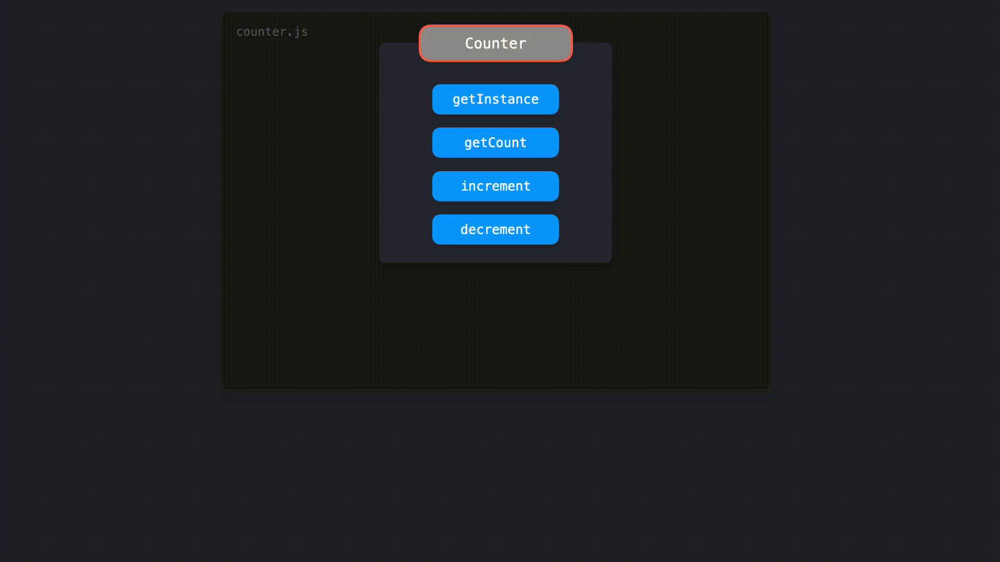

## 单例模式

> 在整个应用程序中共享一个全局实例

单例是可以只被实例化一次的类，并且可以被全局访问。这个唯一的实例可以在整个应用程序中共享，这使得单例非常适合管理应用程序的全局状态。

首先，让我们看一下使用 ES2015 编写的单例是什么样子的。在本例中，我们将构建一个 `Counter` 类，该类具有：

- 返回当前实例的 `getInstance` 方法

- 返回当前 `counter` 值的 `getCount` 方法

- 将 `counter` 值加一的 `increment` 方法

- 将 `counter` 值减一的 `decrement` 方法

```javascript
let counter = 0;

class Counter {
  getInstance() {
    return this;
  }

  getCount() {
    return counter;
  }

  increment() {
    return ++counter;
  }

  decrement() {
    return --counter;
  }
}
```

然而，这个类不符合单例模式的标准！一个单例应该只能被**实例化一次**。当前，我们可以创建 `Counter` 类的多个实例。

```javascript
let counter = 0;

class Counter {
  getInstance() {
    return this;
  }

  getCount() {
    return counter;
  }

  increment() {
    return ++counter;
  }

  decrement() {
    return --counter;
  }
}

const counter1 = new Counter();
const counter2 = new Counter();

console.log(counter1.getInstance() === counter2.getInstance()); // false
```

通过两次调用 `new` 方法对 `Counter` 类进行实例化，我们将两次实例化的结果分别赋值给 `counter1` 和 `counter2`。`counter1` 和 `counter2` 的 `getInstance` 方法返回的值实际上返回了对不同实例的引用：它们严格来说并不相等！


让我们确保只有一个 `Counter` 类的实例可以被创建。

确保只有一个实例被创建的一种方式是创建一个名为 `instance` 的变量。在 `Counter` 的构造函数中，当一个实例被创建的时候，我们可以设置这个变量 `instance` 为当前实例的引用。我们可以通过检查 `instance` 变量是否有值来防止新的实例化。如果 `instance` 变量有值，说明已经有一个实例已经存在了。重复实例化是不因该发生的：应该通过抛出一个错误让用户知晓。

```javascript
let instance;
let counter = 0;

class Counter {
  constructor() {
    if (instance) {
      throw new Error("You can only create one instance!");
    }
    instance = this;
  }

  getInstance() {
    return this;
  }

  getCount() {
    return counter;
  }

  increment() {
    return ++counter;
  }

  decrement() {
    return --counter;
  }
}

const counter1 = new Counter();
const counter2 = new Counter();
// Error: You can only create one instance!
```

太好了！我们已经无法再创建多个实例了。

让我们从 `counter.js` 文件中导出 `Counter` 的实例。但是在这之前，我们应该先**冻结**这个实例。`Object.freeze` 方法确保了使用当前实例的代码无法修改其对应的单例类。被冻结的实例上的属性是无法被添加和修改的，这降低了意外覆盖单例类上的值的风险。

```javascript
let instance;
let counter = 0;

class Counter {
  constructor() {
    if (instance) {
      throw new Error("You can only create one instance!");
    }
    instance = this;
  }

  getInstance() {
    return this;
  }

  getCount() {
    return counter;
  }

  increment() {
    return ++counter;
  }

  decrement() {
    return --counter;
  }
}

const singletonCounter = Object.freeze(new Counter());
export default singletonCounter;
```

------

让我们来看一个实现 Counter 例子的应用程序。我们有以下文件：

- `counter.js`: 包含 `Counter` 类，导出一个 `Counter` 的实例并作为默认导出。
- `index.js`: 加载 `redButton.js` 和 `blueButton.js` 模块。
- `redButton.js`:  导入 `Counter`，并为**红色**按钮将绑定事件监听，当点击按钮触发 `Counter` 的 `increment` 方法时，通过调用 `getCount` 方法记录 `counter` 的当前值。
- `blueButton.js`: 导入 `Counter`，并为**蓝色**按钮将绑定事件监听，当点击按钮触发 `Counter` 的 `increment` 方法时，通过调用 `getCount` 方法记录 `counter` 的当前值。

`blueButton.js` 和 `redButton.js` 文件都从 `counter.js` 中导入相同的实例。这个实例在两个文件中都命名为 `Counter`。



当我们在 `redButton.js` 和 `blueButton.js` 两个文件中的任意一个触发 increment 方法的时候，`Counter` 实例上的 `counter` 属性在两个文件中都会更新。这和点击红色按钮或者蓝色按钮是没有关系的：相同的值在所有的实例中共享。这就是为什么即便是我们在不同的文件中调用该方法，`counter` 都值也一直保持递增。

------

#### 优势和劣势

将实例化限制为只能有一个实例能够节省很多内存空间。我们不必每次都为一个新实例设置内存，只需要为整个应用程序中所引用的唯一实例设置内存即可。然而，单例模式实际上被认为是一种反模式，一种可以（或..应该）在 Javascript 中避免使用的模式。

在许多编程语言中，比如 Java 或 C++，不可能像在 JavaScript 中那样直接创建对象。在这些面向对象的编程语言中，我们需要先创建一个类，然后使用该类来创建一个对象。就像 JavaScript 示例中的实例的值一样，所创建的对象也具有类的实例的值。

然而，上面示例中所示的类的实现实际上有些过度编码了。因为我们可以直接在 JavaScript 中创建对象，所以我们可以简单地使用常规对象来实现完全相同的结果。让我们讨论一下使用单例的一些缺点！

**使用常规对象**

让我们使用与前面相同的示例。然而，这次 `counter` 只是一个包含以下内容的对象：

- 一个 `count` 属性
- 一个将 `count` 的值加 1 的 `increment` 方法
- 一个将 `count` 的值减 1 的 `decrement` 方法

> ------
>
> > 打开 https://codesandbox.io/embed/competent-moon-rvzrr 查看示例代码
>
> ------

因为对象是通过引用传递的，所以 `redButton.js` 文件和 `blueButton.js` 文件引入了同一个 `counter` 对象。在任何文件中修改 `count` 的值都会反应到 `counter` 上，同时，这在两个文件中都是可见的。

#### 测试

依赖于单例的测试代码可能会变得很棘手。由于我们不能每次创建新实例，因此所有的测试都依赖于对全局实例的前一个测试的修改。在这种情况下，测试的顺序很重要，并且一个小的修改可能会导致整个测试的失败。完成测试后，我们需要重置整个实例，以便重置测试所做的修改。

> ------
>
> > 打开 https://codesandbox.io/embed/sweet-cache-n55vi 查看示例代码
>
> ------

**依赖项隐藏**

当导入另一个模块时，比如本例中的 `superCounter.js`，可能不像是在导入一个单例。在其他文件中，这种情况下例如 `index.js`，我们可能会导入该模块并调用其方法。这样，我们意外地修改了单例中的值。这可能会导致意外的行为，因为可以在整个应用程序中共享单例的多个实例，这些实例也会被修改。

> ------
>
> > 打开 https://codesandbox.io/embed/sweet-cache-n55vi 查看示例代码
>
> ------

#### 全局行为

一个单例实例应该能够在整个应用程序中被引用。全局变量基本上表现为相同的行为：由于全局变量在全局范围内是可用的，因此我们可以在整个应用程序中访问这些变量。

使用全局变量通常被认为是一个糟糕的设计决策。全局范围污染可能最终导致全局变量的值被意外覆盖，这可能引起许多意外行为。

在 ES2015 中，创建全局变量是相当罕见的。新的 `let` 和 `const` 关键字通过将这两个关键字声明的变量保持在块作用域内，以防止开发人员意外污染全局作用域。JavaScript 中新的模块系统允许从模块中导出值，并将这些值导入其他文件，从而更容易创建全局可访问的值，而不会污染全局作用域。

然而，单例模式的常见用例是在整个应用程序中保持某种全局状态。让代码库的多个部分依赖于同一个可变对象可能会导致意外行为。

通常，代码库的某些部分修改全局状态中的值，而其他部分则使用该数据。这里的执行顺序很重要：我们不希望在没有数据可供使用的情况下意外地首先使用数据！随着应用程序的增长，在使用全局状态时理解数据流可能会变得非常棘手，并且许多组件之间还相互依赖。

#### React中的状态管理

在 React 中，我们通常通过例如 **Redux** 或 **React Context** 的状态管理工具来依赖于全局状态，而不是使用单例。虽然它们的全局状态行为可能类似于单例，但这些工具提供的是**只读**状态，而不是单例的可变状态。当使用 Redux 时，只有纯函数的 `reducers` 在组件通过调度器发送操作行为后才能更新状态。

虽然使用这些工具不会神奇地消除全局状态的缺点，但我们至少可以确保全局状态按我们的意愿发生变化，因为组件无法直接更新状态。

#### 参考文档

- [Do React Hooks replace Redux - Eric Elliott](https://medium.com/javascript-scene/do-react-hooks-replace-redux-210bab340672)
- [Working with Singletons in JavaScript - Vijay Prasanna](https://alligator.io/js/js-singletons/)
- [JavaScript Design Patterns: The Singleton - Samier Saeed](https://www.sitepoint.com/javascript-design-patterns-singleton/)
- [Singleton - Refactoring Guru](https://refactoring.guru/design-patterns/singleton)

