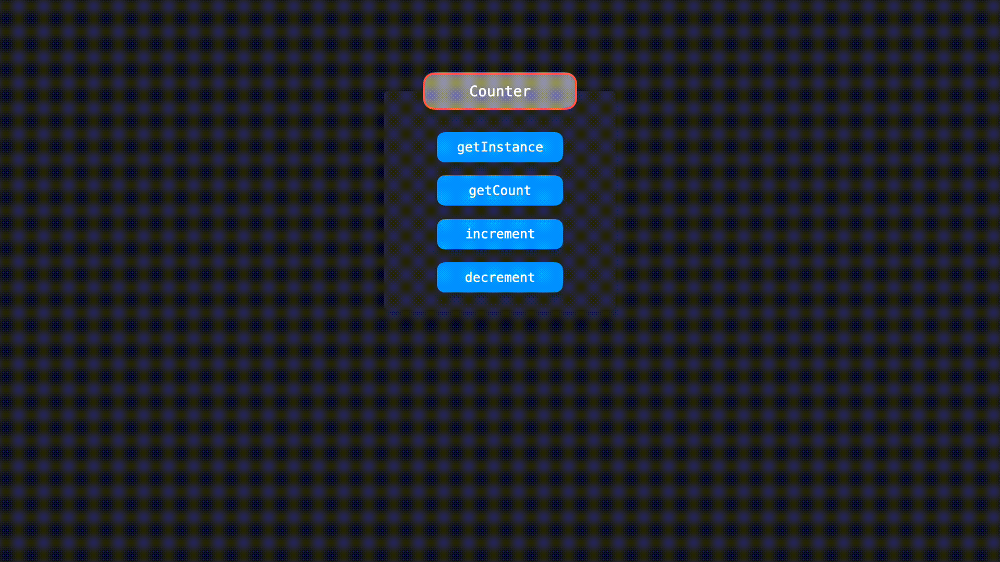

## 单例模式

> 在整个应用程序中共享一个全局实例

单例是可以只被实例化一次的类，并且可以被全局访问。这个唯一的实例可以在整个应用程序中共享，这使得单例非常适合管理应用程序的全局状态。

首先，让我们看一下使用 ES2015 编写的单例是什么样子的。在本例中，我们将构建一个 `Counter` 类，该类具有：

- 返回当前实例的 `getInstance` 方法

- 返回当前 `counter` 值的 `getCount` 方法

- 将 `counter` 值加一的 `increment` 方法

- 将 `counter` 值减一的 `decrement` 方法

```javascript
let counter = 0;

class Counter {
  getInstance() {
    return this;
  }

  getCount() {
    return counter;
  }

  increment() {
    return ++counter;
  }

  decrement() {
    return --counter;
  }
}
```

然而，这个类不符合单例模式的标准！一个单例应该只能被**实例化一次**。当前，我们可以创建 `Counter` 类的多个实例。

```javascript
let counter = 0;

class Counter {
  getInstance() {
    return this;
  }

  getCount() {
    return counter;
  }

  increment() {
    return ++counter;
  }

  decrement() {
    return --counter;
  }
}

const counter1 = new Counter();
const counter2 = new Counter();

console.log(counter1.getInstance() === counter2.getInstance()); // false
```

通过两次调用 `new` 方法对 `Counter` 类进行实例化，我们将两次实例化的结果分别赋值给 `counter1` 和 `counter2`。`counter1` 和 `counter2` 的 `getInstance` 方法返回的值实际上返回了对不同实例的引用：它们严格来说并不相等！



让我们确保只有一个 `Counter` 类的实例可以被创建。

确保只有一个实例被创建的一种方式是创建一个名为 `instance` 的变量。在 `Counter` 的构造函数中，当一个实例被创建的时候，我们可以设置这个变量 `instance` 为当前实例的引用。我们可以通过检查 `instance` 变量是否有值来防止新的实例化。如果 `instance` 变量有值，说明已经有一个实例已经存在了。重复实例化是不因该发生的：应该通过抛出一个错误让用户知晓。

```javascript
let instance;
let counter = 0;

class Counter {
  constructor() {
    if (instance) {
      throw new Error("You can only create one instance!");
    }
    instance = this;
  }

  getInstance() {
    return this;
  }

  getCount() {
    return counter;
  }

  increment() {
    return ++counter;
  }

  decrement() {
    return --counter;
  }
}

const counter1 = new Counter();
const counter2 = new Counter();
// Error: You can only create one instance!
```

太好了！我们已经无法再创建多个实例了。

让我们从 `counter.js` 文件中导出 `Counter` 的实例。但是在这之前，我们应该先**冻结**这个实例。`Object.freeze` 方法确保了使用当前实例的代码无法修改其对应的单例类。被冻结的实例上的属性是无法被添加和修改的，这降低了意外覆盖单例类上的值的风险。

```javascript
let instance;
let counter = 0;

class Counter {
  constructor() {
    if (instance) {
      throw new Error("You can only create one instance!");
    }
    instance = this;
  }

  getInstance() {
    return this;
  }

  getCount() {
    return counter;
  }

  increment() {
    return ++counter;
  }

  decrement() {
    return --counter;
  }
}

const singletonCounter = Object.freeze(new Counter());
export default singletonCounter;
```

