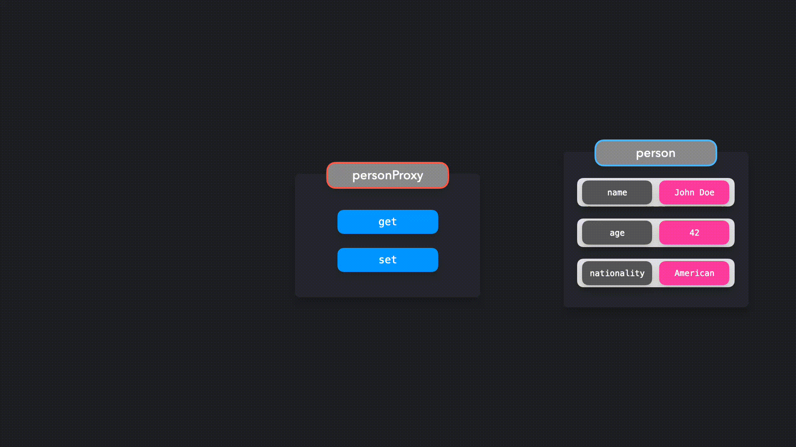

## 代理模式

> 目标对象的拦截和控制交互

通过代理对象，我们可以更好地控制与某些对象的交互。代理对象可以在我们与对象交互时确定行为，例如当我们获取值或设置值时。

------

一般来说，代理意味着某人的替补。你将与你试图联系的人的代理人交谈，而不是直接与该人交谈。JavaScript 中也存在类似的情况：我们将与代理对象交互，而不是直接与目标对象交互。

------

让我们创建一个 `person` 对象，它代表 John Doe。

```javascript
const person = {
  name: "John Doe",
  age: 42,
  nationality: "American"
};
```

我们希望与代理对象交互，而不是直接与该对象交互。在 JavaScript 中，我们可以通过创建 `Proxy` 的一个新实例来轻松创建新代理。

```javascript
const person = {
  name: "John Doe",
  age: 42,
  nationality: "American"
};

const personProxy = new Proxy(person, {});
```

`Proxy` 的第二个参数表示处理程序的对象（handler）。在 `handler` 对象中，我们可以根据交互的类型来定义特定的行为。尽管有许多方法可以添加到代理处理程序中，但最常见的两种方法是 `get` 和 `set`：

- `get`: 在尝试访问属性时调用
- `set`: 在尝试修改属性时调用

实际上，最终会发生以下情况：



我们将与 `personProxy` 交互，而不是直接与 `person` 对象交互。

让我们向 `personProxy` 代理添加处理程序。当试图修改属性，从而调用代理上的 `set` 方法时，我们希望代理记录属性的先前值和新值。当试图访问属性，从而调用代理上的 `get` 方法时，我们希望代理记录一个更可读的包含属性的键和值的句子。

```javascript
const personProxy = new Proxy(person, {
  get: (obj, prop) => {
    console.log(`The value of ${prop} is ${obj[prop]}`);
  },
  set: (obj, prop, value) => {
    console.log(`Changed ${prop} from ${obj[prop]} to ${value}`);
    obj[prop] = value;
  }
});
```

太棒了！让我们看看当我们试图修改或获取属性时会发生什么。

> ------
>
> > 打开 https://codesandbox.io/embed/cocky-bird-rkgyo 查看示例代码
>
> ------

当访问 `name` 属性时，`Proxy` 返回了一个听起来更好的句子：“The value of name is John Doe.”。

当修改 `age` 属性时，`Proxy` 返回了这个属性的上一个值和新值：“Changed age from 42 to 43.”。

------

代理可以用于添加验证。用户不应该将人的年龄更赋值为字符串，或者给他们一个空名字。或者，如果用户试图访问对象上不存在的属性时，我们应该让用户知道。

```javascript
const personProxy = new Proxy(person, {
  get: (obj, prop) => {
    if (!obj[prop]) {
      console.log(
        `Hmm.. this property doesn't seem to exist on the target object`
      );
    } else {
      console.log(`The value of ${prop} is ${obj[prop]}`);
    }
  },
  set: (obj, prop, value) => {
    if (prop === "age" && typeof value !== "number") {
      console.log(`Sorry, you can only pass numeric values for age.`);
    } else if (prop === "name" && value.length < 2) {
      console.log(`You need to provide a valid name.`);
    } else {
      console.log(`Changed ${prop} from ${obj[prop]} to ${value}.`);
      obj[prop] = value;
    }
  }
});
```

让我们看看当我们试图传递错误值时会发生什么！

> ------
>
> > 打开 https://codesandbox.io/embed/focused-rubin-dgk2v 查看示例代码
>
> ------

代理确保我们没有用错误的值来修改 `person` 对象，这有助于我们保持数据的干净！

------

#### 反射（Reflect）

JavaScript 提供了一个名为 `Reflect` 的内置对象，这使我们在使用代理时更容易操作目标对象。

以前，我们直接通过中括号的方式来修改和访问被代理对象上的属性。相反的，我们可以使用反射对象（Reflect）。反射对象（Reflect）上的方法与 `handler` 对象上的方法具有相同的名称。

我们可以通过 `Reflect.get()` 和 `Reflect.set()` 分别访问和修改目标对象的属性，而不用通过 `obj[prop]`  来访问属性或通过 `obj[prop] = value` 来设置属性。这些方法接收的参数与 `handler` 对象上的方法相同。

```javascript
const personProxy = new Proxy(person, {
  get: (obj, prop) => {
    console.log(`The value of ${prop} is ${Reflect.get(obj, prop)}`);
  },
  set: (obj, prop, value) => {
    console.log(`Changed ${prop} from ${obj[prop]} to ${value}`);
    Reflect.set(obj, prop, value);
  }
});
```

太棒了！我们可以使用反射对象（Reflect）轻松的访问和修改目标对象上的属性了。

> ------
>
> > 打开 https://codesandbox.io/embed/gallant-violet-o1hjx 查看示例代码
>
> ------

------

代理是添加对对象行为控制的有效方式。代理可以有各种用例：它可以帮助验证、格式化、通知或调试。

过度使用代理对象或对每个 `handler` 方法执行繁重的操作很容易对应用程序的性能产生负面影响。对于注重性能的代码，最好不要使用代理。

------

#### 参考文档

- [Proxy](https://developer.mozilla.org/en-US/docs/Web/JavaScript/Reference/Global_Objects/Proxy) - MDN
- [JavaScript Proxy](https://davidwalsh.name/javascript-proxy) - David Walsh
- [Awesome ES2015 Proxy](https://github.com/mikaelbr/awesome-es2015-proxy) - GitHub @mikaelbr
- [Thoughts on ES6 Proxies Performance](http://thecodebarbarian.com/thoughts-on-es6-proxies-performance) - Valeri Karpov