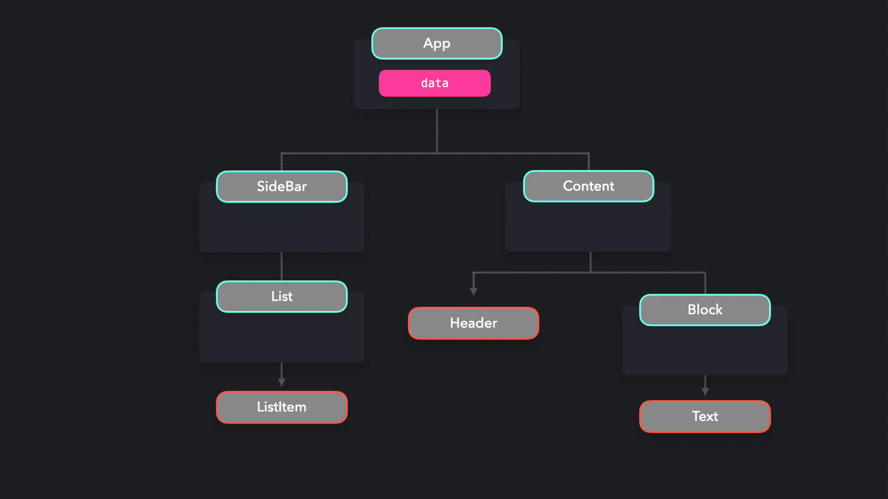
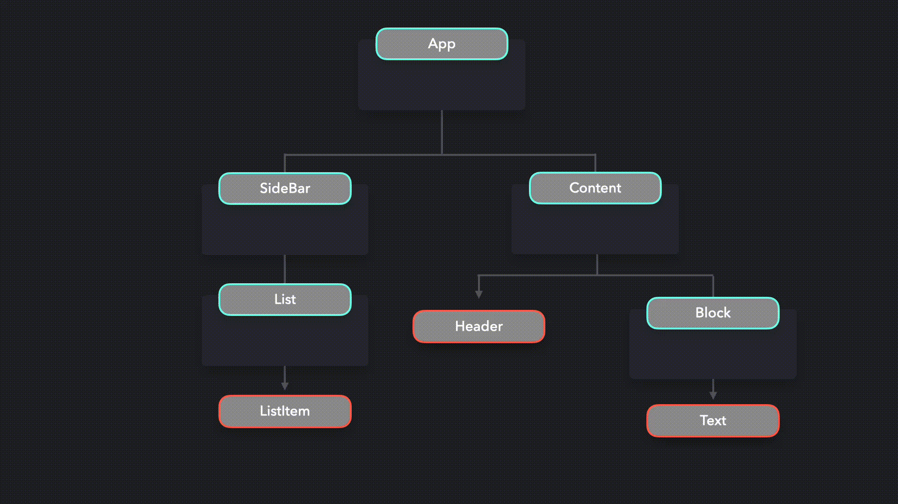

## 提供者模式

> 使数据可用于多个子组件

在很多情况下，我们希望为应用程序中的一些（如果不是全部）组件提供可用数据。虽然我们可以使用 `props` 将数据传递给组件，但如果应用程序中几乎所有的组件都需要访问 props 的值，那么这可能很难做到。

当我们将 `props` 传递到组件树的下方时，我们经常会用到一种叫做 `prop drilling` 的东西。重构依赖于 `props` 的代码几乎是不可能的，而且很难知道某些数据来自哪里。

假设我们有一个包含特定数据的 `App` 组件。在组件树的最底层，我们有一个 `ListItem`、`Header` 和 `Text` 组件，它们都需要这些数据。为了将这些数据传输到这些组件，我们必须将其通过很多层组件。



在我们的代码库中，这将类似于以下内容：

```javascript
function App() {
  const data = { ... }

  return (
    <div>
      <SideBar data={data} />
      <Content data={data} />
    </div>
  )
}

const SideBar = ({ data }) => <List data={data} />
const List = ({ data }) => <ListItem data={data} />
const ListItem = ({ data }) => <span>{data.listItem}</span>

const Content = ({ data }) => (
  <div>
    <Header data={data} />
    <Block data={data} />
  </div>
)
const Header = ({ data }) => <div>{data.title}</div>
const Block = ({ data }) => <Text data={data} />
const Text = ({ data }) => <h1>{data.text}</h1>
```

这种方式传递 `props` 会变的很混乱。如果我们想在将来重命名数据 `prop`，那么我们必须在所有组件中重命名它。当应用程序变得越大，`prop drilling` 就就会变的越复杂。

如果我们可以跳过不需要使用这些数据的所有组件层，那这将会是最佳选择。我们需要通过一些方式，让需要访问数据值的组件直接访问数据，而不依赖于 `prop drilling`。

这就是提供者模式可以帮助我们的地方！通过提供程序模式，我们可以将数据提供给多个组件。我们可以将所有组件包装在一个提供者中，而不是通过 `props` 将数据传递到每一层。提供者是 `Context` 对象所提供的高阶组件。我们可以使用 React 提供的 `createContext` 方法创建一个 `Context`  对象。

提供者接收一个 `prop` 参数，其中包含我们想要传递的数据。包装在此提供者中的所有组件都可以访问 `prop` 的值。

```javascript
const DataContext = React.createContext()

function App() {
  const data = { ... }

  return (
    <div>
      <DataContext.Provider value={data}>
        <SideBar />
        <Content />
      </DataContext.Provider>
    </div>
  )
}
```

我们不再需要手动将数据传递给每个组件了！那么，`ListItem`、`Header` 和 `Text` 组件如何访问数据的值呢？

每个组件都可以通过 `useContext` 钩子函数来访问数据。这个钩子函数接收数据引用的上下文（context），在本例中是 `DataContext`。`useContext` 钩子函数允许我们对 context 对象进行读写数据。

```javascript
const DataContext = React.createContext();

function App() {
  const data = { ... }

  return (
    <div>
      <SideBar />
      <Content />
    </div>
  )
}

const SideBar = () => <List />
const List = () => <ListItem />
const Content = () => <div><Header /><Block /></div>


function ListItem() {
  const { data } = React.useContext(DataContext);
  return <span>{data.listItem}</span>;
}

function Text() {
  const { data } = React.useContext(DataContext);
  return <h1>{data.text}</h1>;
}

function Header() {
  const { data } = React.useContext(DataContext);
  return <div>{data.title}</div>;
}
```

不使用数据的组件根本不需要进行数据的处理。我们也不再需要担心通过层层组件的 `props` 向下传递数据，即便这些组件并不需要这些数据，这同时使得重构更加容易。



------

提供者模式对于共享全局数据非常有用。提供者模式的一个常见用例是在许多组件中共享主题 UI 的状态。

假设我们有一个显示列表的简单应用程序。

> ------
>
> > 打开 https://codesandbox.io/embed/busy-oskar-ifz3w 查看示例代码
>
> ------

我们希望用户能够通过切换开关在 lightmode 和 darkmode 两个主题之间互相切换。当用户从 darkmode 模式切换到 lightmode 模式时，背景颜色和文本颜色应该也随之改变，反之亦然！我们可以将组件包装在 `ThemeProvider` 中，并将当前主题颜色传递给提供者，而不是将当前主题状态传递给每个组件。

```javascript
export const ThemeContext = React.createContext();

const themes = {
  light: {
    background: "#fff",
    color: "#000"
  },
  dark: {
    background: "#171717",
    color: "#fff"
  }
};

export default function App() {
  const [theme, setTheme] = useState("dark");

  function toggleTheme() {
    setTheme(theme === "light" ? "dark" : "light");
  }

  const providerValue = {
    theme: themes[theme],
    toggleTheme
  };

  return (
    <div className={`App theme-${theme}`}>
      <ThemeContext.Provider value={providerValue}>
        <Toggle />
        <List />
      </ThemeContext.Provider>
    </div>
  );
}
```

由于 `Toggle` 和 `List` 组件都包装在 `ThemeContext` 提供者程序中，因此我们可以访问 `theme` 的值和 `toggleTheme`，而这都是作为提供者的值传递进来的。

在 `Toggle` 组件中，我们可以使用 `toggleTheme` 函数相应地更新主题。

```javascript
import React, { useContext } from "react";
import { ThemeContext } from "./App";

export default function Toggle() {
  const theme = useContext(ThemeContext);

  return (
    <label className="switch">
      <input type="checkbox" onClick={theme.toggleTheme} />
      <span className="slider round" />
    </label>
  );
}
```

`List` 组件本身并不关心主题的当前值。但是，`ListItem` 组件关心这个值！我们可以在 `ListItem` 组件中直接使用主题上下文（theme context）。

```javascript
import React, { useContext } from "react";
import { ThemeContext } from "./App";

export default function TextBox() {
  const theme = useContext(ThemeContext);

  return <li style={theme.theme}>...</li>;
}
```

太棒了！我们不必将主题当前值传递给任何不需要关心这个值的组件了。


> ------
>
> > 打开 https://codesandbox.io/embed/quirky-sun-9djpl 查看示例代码
>
> ------

#### 钩子函数（Hooks）

我们可以创建一个钩子函数（hook）来为组件提供上下文（context）。我们可以使用一个钩子函数（hook）来返回我们需要的上下文（context），而不必在每个组件中都导入 `useContext` 和 `Context`。

```javascript
function useThemeContext() {
  const theme = useContext(ThemeContext);
  return theme;
}
```

为了确保它是一个有效的主题，如果 `useContext`(ThemeContext) 返回一个错误值，我们就抛出一个错误。

```javascript
function useThemeContext() {
  const theme = useContext(ThemeContext);
  if (!theme) {
    throw new Error("useThemeContext must be used within ThemeProvider");
  }
  return theme;
}
```

我们可以创建一个用于包装组件的高阶组件（HOC）来为其提供值，而不是直接使用 `ThemeContext.Provider` 来进行包装。这样，我们可以将上下文逻辑从渲染组件中分离出来，从而提高 provider 的可重用性。

```javascript
function ThemeProvider({children}) {
  const [theme, setTheme] = useState("dark");

  function toggleTheme() {
    setTheme(theme === "light" ? "dark" : "light");
  }

  const providerValue = {
    theme: themes[theme],
    toggleTheme
  };

  return (
    <ThemeContext.Provider value={providerValue}>
      {children}
    </ThemeContext.Provider>
  );
}

export default function App() {
  return (
    <div className={`App theme-${theme}`}>
      <ThemeProvider>
        <Toggle />
        <List />
      </ThemeProvider>
    </div>
  );
}
```

每个需要访问 `ThemeContext` 的组件现在都可以轻松的使用 `useThemeContext` 钩子函数了。

```javascript
export default function TextBox() {
  const theme = useThemeContext();

  return <li style={theme.theme}>...</li>;
}
```

通过为不同的上下文创建钩子函数（hook），可以很容易将 provider 的逻辑与数据渲染组件分离开来。

------

#### 实例学习

一些库提供了内置的 provider，我们可以在消费组件中使用这些值。一个很好的例子是样式化组件（styled-components）。

> 理解这个例子不需要有样式化组件（styled-components）的经验。

styled-components 库为我们提供了 `ThemeProvider`。每个样式化组件都可以访问该提供者的值！我们可以使用提供给我们的上下文 API，而不用自己创建上下文 API！

让我们使用相同的 `List` 示例，将组件包装在从 styled-component 库导入的 `ThemeProvider` 中。

```javascript
import { ThemeProvider } from "styled-components";

export default function App() {
  const [theme, setTheme] = useState("dark");

  function toggleTheme() {
    setTheme(theme === "light" ? "dark" : "light");
  }

  return (
    <div className={`App theme-${theme}`}>
      <ThemeProvider theme={themes[theme]}>
        <>
          <Toggle toggleTheme={toggleTheme} />
          <List />
        </>
      </ThemeProvider>
    </div>
  );
}
```

我们将写一个 `styled.li` 组件，而不是将内联样式通过 prop 传递给 `ListItem` 组件。由于它是一个样式化的组件，我们可以直接访问主题的值！

```javascript
import styled from "styled-components";

export default function ListItem() {
  return (
    <Li>
      Lorem ipsum dolor sit amet, consectetur adipiscing elit, sed do eiusmod
      tempor incididunt ut labore et dolore magna aliqua. Ut enim ad minim
      veniam, quis nostrud exercitation ullamco laboris nisi ut aliquip ex ea
      commodo consequat.
    </Li>
  );
}

const Li = styled.li`
  ${({ theme }) => `
     background-color: ${theme.backgroundColor};
     color: ${theme.color};
  `}
`;
```

太棒了，我们现在可以使用 `ThemeProvider` 轻松地将样式应用到我们所有的样式组件中了！


> ------
>
> > 打开 https://codesandbox.io/embed/divine-platform-gbuls 查看示例代码
>
> ------


------

#### 优点

提供者模式或 Context API 可以将数据传递给很多组件，而无需手动将其传递给每层组件。

它降低了重构代码时意外引入错误的风险。在这之前，如果我们以后想重命名一个 prop 属性，我们必须在使用该 prop 属性的整个应用程序中重新命名。

我们不再需要处理 prop-drilling，这可能被视为一种反模式。以前，应用程序的数据流可能很难理解，因为某些 prop 属性的值的来源并不总是很清楚。使用提供者模式，我们不再需要向不关心这些数据的组件传递不必要的 props 属性。

使用提供者模式可以轻松地保持某种全局状态，因为我们可以让组件直接访问这种全局状态。

#### 缺点

在某些情况下，过度使用提供者模式可能会导致性能问题。每次状态更改时，使用上下文（context）的所有组件都会重新渲染。

让我们来看一个例子。我们有一个简单的计数器，每次单击按钮组件中的“增量”按钮时，该计数器的值都会增加。我们在重置组件中还有一个重置按钮，可以将计数重置回 0。

但是，当单击“增量”按钮时，可以看到重新渲染的不仅仅是计数。重置组件中的日期也会重新渲染！

重置组件也重新渲染，因为它使用了 useCountContext。在较小的应用程序中，这并没有什么影响。在大型应用程序中，将频繁更新的值传递给许多组件可能会对性能产生负面影响。

为了确保组件不会使用包含可能不相关值的提供者，您可以为每个单独的用例创建几个提供者。

> ------
>
> > 打开 https://codesandbox.io/embed/provider-pattern-2-4ke0w 查看示例代码
>
> ------


Not ending.

------

#### 参考文档

- [Proxy](https://developer.mozilla.org/en-US/docs/Web/JavaScript/Reference/Global_Objects/Proxy) - MDN
- [JavaScript Proxy](https://davidwalsh.name/javascript-proxy) - David Walsh
- [Awesome ES2015 Proxy](https://github.com/mikaelbr/awesome-es2015-proxy) - GitHub @mikaelbr
- [Thoughts on ES6 Proxies Performance](http://thecodebarbarian.com/thoughts-on-es6-proxies-performance) - Valeri Karpov