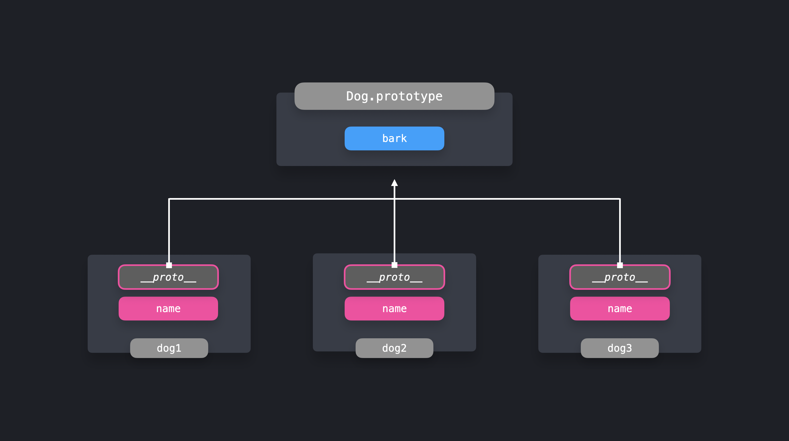
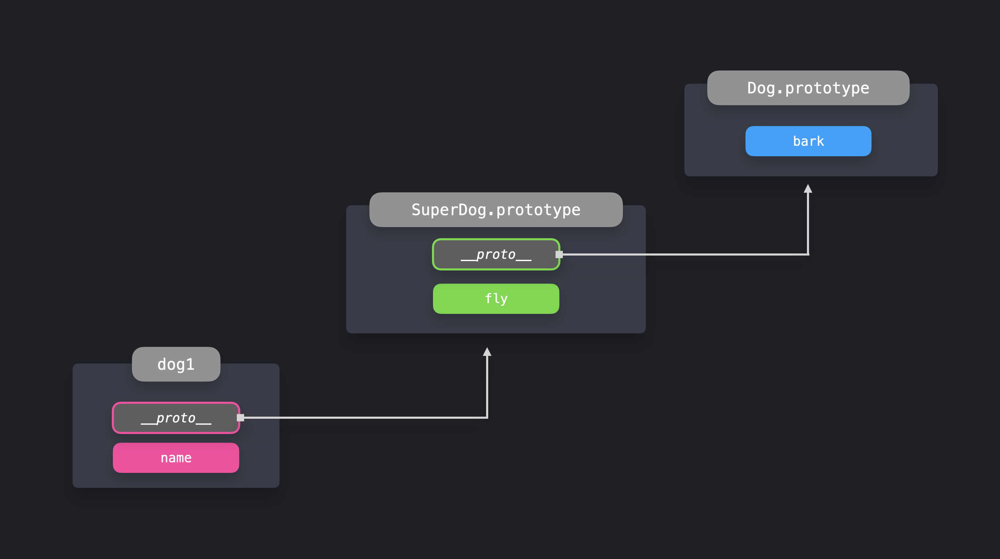

## 原型模式

> 在同类型的多个对象之间共享属性

原型模式是一种在同类型的对象之间共享属性的有效方法。原型是 JavaScript 的原生对象，可以通过原型链被对象访问。

在我们的应用程序中，我们经常需要创建许多同类型的对象。一种有效的方法是通过 ES6 的 class 语法来创建类的多个实例。

假设我们想要创造许多狗！在我们的例子中，狗可以做的事情有：它们只是有一个名字，并且可以吠叫！

```javascript
class Dog {
  constructor(name) {
    this.name = name;
  }

  bark() {
    return `Woof!`;
  }
}

const dog1 = new Dog("Daisy");
const dog2 = new Dog("Max");
const dog3 = new Dog("Spot");
```

在这里构造函数 `constructor` 包含一个 `name` 属性，并且类本身包含一个 `bark` 属性。当使用 ES6 的类时，在类本身上定义的所有属性（在本例中为 `bark`）都会被自动添加到原型 `prototype` 中。

我们可以通过访问构造函数上的 `prototype` 属性直接访问原型，或者通过任何实例上的 `__proto__` 属性访问原型。

```javascript
console.log(Dog.prototype);
// constructor: ƒ Dog(name, breed) bark: ƒ bark()

console.log(dog1.__proto__);
// constructor: ƒ Dog(name, breed) bark: ƒ bark()
```

在构造函数的任何实例上，`__proto__` 的值都是对构造函数原型的直接引用！每当我们试图直接访问一个在对象上不存在的属性时，JavaScript 就会沿着原型链查找，检查该属性在原型链中是否存在。



当处理应该具有相同属性的对象时，原型模式非常强大。我们可以简单地将属性添加到原型中，而不是每次都创建属性的副本，因为所有实例都可以访问原型对象。

由于所有实例都可以访问原型，因此即使在创建实例之后，也可以很容易地向原型中添加属性。

假如我们的狗不仅应该会吠叫，还应该会玩！我们可以通过向原型中添加 `play` 属性来实现这一点。

> ------
>
> > 打开 https://codesandbox.io/embed/eloquent-turing-v42kr 查看示例代码
>
> ------

“原型链”一词表示可以有多个步骤。的确到目前为止，我们只看到了如何直接访问被 `__proto__` 所引用的第一个对象上的属性。然而，原型本身也有一个 `__proto` 对象！

让我们创造另一种类型的狗，超级狗！这只狗应该继承正常狗的所有属性，但它也应该能飞。我们可以通过扩展 `Dog` 类和添加 `fly` 方法来创建超级狗。

```javascript
class SuperDog extends Dog {
  constructor(name) {
    super(name);
  }

  fly() {
    return "Flying!";
  }
}
```

让我们创造一只名叫 Daisy 的飞狗，让她吠叫着飞吧！

> ------
>
> > 打开 https://codesandbox.io/embed/hopeful-poitras-vuch6 查看示例代码
>
> ------

由于扩展了 `Dog` 类，我们可以使用 `bark` 方法。`SuperDog` 原型上的 `__proto` 值指向 `Dog.prototype` 对象！



这就清楚为什么它被称为原型链：当我们试图访问对象上不存在的属性时，JavaScript 会递归地遍历所有 `__proto` 指向的对象，直到找到该属性为止！

------

#### Object.create

`Object.create` 方法允许我们创建一个新的对象，并且可以显式地将其原型上的值传递给该对象。

```javascript
const dog = {
  bark() {
    return `Woof!`;
  }
};

const pet1 = Object.create(dog);
```

虽然 `pet1` 本身没有任何属性，但它确实可以访问其原型链上的属性！由于我们将 `dog` 对象作为 `pet1` 的原型传递，因此我们可以访问 `bark` 属性。

> ------
>
> > 打开 https://codesandbox.io/embed/funny-wing-w38zk 查看示例代码
>
> ------

太棒了！`Object.create` 是一种通过指定新创建对象原型的简单方式，让对象直接从其他对象继承属性。新对象可以通过遍历原型链来访问新的属性。

------

原型模式允许我们轻松地让对象访问和继承其他对象的属性。由于原型链允许我们访问对象本身未直接定义的属性，因此我们可以避免方法和属性的重复，从而减少内存的使用。

------

#### 参考文档

- [Object.create](https://developer.mozilla.org/en-US/docs/Web/JavaScript/Reference/Global_Objects/Object/create) - MDN
- [Prototype](https://www.ecma-international.org/ecma-262/5.1/#sec-4.3.5) - ECMA

