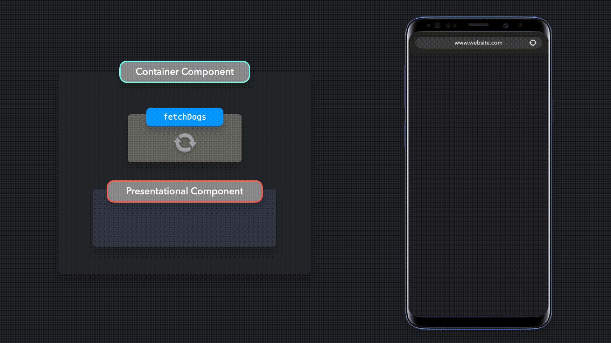
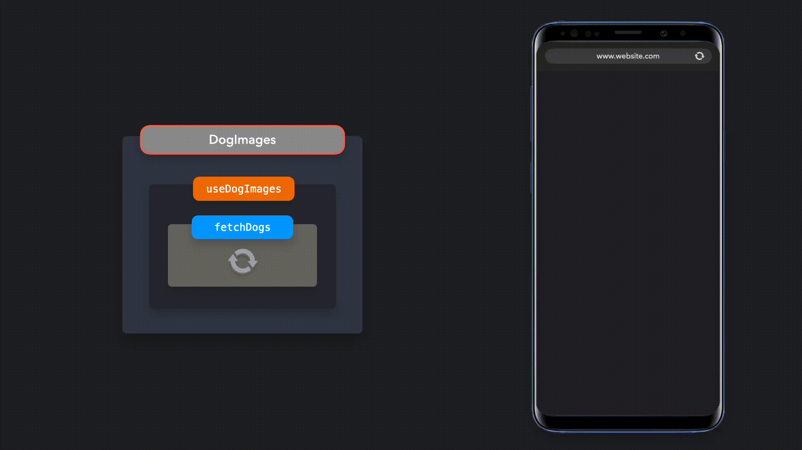

# 容器/呈现模式

> 通过将视图与程序逻辑分离来强制分离关注点

在 React 中，强制分离关注点的一种方法是使用容器/呈现模式。使用此模式，我们可以将视图与程序逻辑分离。

------

假设我们想创建一个获取 6 个狗的图像的应用程序，并在屏幕上呈现这些图像。

理想情况下，我们希望通过将此过程分为两部分来强制分离关注点：

1. 呈现组件：关心数据如何显示给用户的组件。在本例中，用于渲染狗图像的列表。
2. 容器组件：关心向用户显示哪些数据的组件。在本例中，用于获取狗的图像。

------



获取狗图像需要处理应用程序逻辑，而显示图像仅需要处理视图。

------

## 呈现组件

呈现组件通过 `props` 接收其数据。它的主要功能是以我们希望的方式简单地显示接收到的数据，包括样式，而不修改该数据。

让我们看一下显示狗图像的示例。在渲染狗图像时，我们只想映射从 API 获取的每个狗的图像，并渲染这些图像。为了做到这一点，我们可以创建一个功能组件，该组件通过 `props` 接收数据，并呈现它接收到的数据。

> ------
>
> > 打开 https://codesandbox.io/embed/sleepy-murdock-if0ec 查看示例代码
>
> ------

`DogImages` 组件是一个呈现组件。呈现组件通常是无状态的：它们不包含自己的 React 状态，除非出于 UI 的目的需要状态。他们收到的数据也不会被呈现组件本身改变。

呈现组件从容器组件中接收数据。

------

## 容器组件

容器组件的主要功能是将数据传递给它们所包含的呈现组件。除了关心其数据的呈现组件之外，容器组件本身通常不会渲染任何其他组件。由于它们本身不渲染任何内容，因此通常也不包含任何样式。

在我们的示例中，我们希望将狗图像传递给 `DogsImages` 表示组件。在能够这样做之前，我们需要从外部 API 获取图像。我们需要创建一个容器组件来获取这些数据，并将这些数据传递给表示组件 `DogImages`，以便将其显示在屏幕上。

> ------
>
> > 打开 https://codesandbox.io/embed/sleepy-murdock-if0ec 查看示例代码
>
> ------

将这两个组件结合在一起，可以将处理应用程序逻辑与视图分离。


------

## 钩子函数

在许多情况下，容器/呈现模式可以用 React Hooks 代替。钩子的引入使得开发人员很容易添加状态，而不需要容器组件来提供状态。

我们可以创建一个自定义的钩子函数来获取图像，并返回存有狗数据的数组，而不是在 `DogImagesContainer` 组件中定义数据获取逻辑。

```javascript
export default function useDogImages() {
  const [dogs, setDogs] = useState([]);

  useEffect(() => {
    fetch("https://dog.ceo/api/breed/labrador/images/random/6")
      .then(res => res.json())
      .then(({ message }) => setDogs(message));
  }, []);

  return dogs;
}
```

通过使用钩子函数，我们不再需要包装 `DogImagesContainer` 容器组件来获取数据，并将其发送到 `DogImages` 渲染组件中。相反，我们可以直接在 `DogImages` 渲染组件中使用这个钩子函数！

> ------
>
> > 打开 https://codesandbox.io/embed/rough-brook-tzp7i 查看示例代码
>
> ------

通过使用 `useDogImages` 钩子函数，我们仍然将应用程序逻辑与视图分离。我们只是使用了 `useDogImages` 钩子函数返回的数据，而没有修改 `DogImages` 组件中的数据。



钩子函数可以很容易地在组件中分离逻辑和视图，就像容器/呈现模式一样。它为我们节省了在容器组件中为包装表示组件所需的额外组件层。

------

#### 优势

使用容器/表示模式有许多好处。

容器/呈现模式鼓励分离关注点。呈现组件可以是负责 UI 的纯函数，而容器组件负责应用程序的状态和数据。这使得实施关注点分离变得容易。

呈现组件易于重用，因为它们只显示数据而不更改数据。我们可以在整个应用程序中为不同的目的而重用呈现组件。

由于呈现组件不会改变应用程序逻辑，所以呈现组件的外观可以很容易地被不了解代码库的人更改，例如设计者。如果在应用程序的许多部分中重用了呈现组件，则这些更改可以是一致的。

测试呈现组件很容易，因为它们通常是纯函数。我们知道组件将根据我们传递的数据呈现什么，而不必模拟数据存储。

------

#### 劣势

容器/呈现模式使得将应用程序逻辑与呈现逻辑分离变得容易。然而，钩子函数可以实现相同的结果，而不必使用容器/呈现模式，同时也不必将无状态函数组件重写为类组件。注意，今天，我们不再需要创建类组件来使用状态。

尽管我们仍然可以使用容器/呈现模式，即使使用 React 钩子函数，但在较小规模的应用程序中，这种模式很容易成为一种过度使用的模式。

------

#### 参考文档

- [Presentational and Container Components - Dan Abramov](https://medium.com/@dan_abramov/smart-and-dumb-components-7ca2f9a7c7d0)